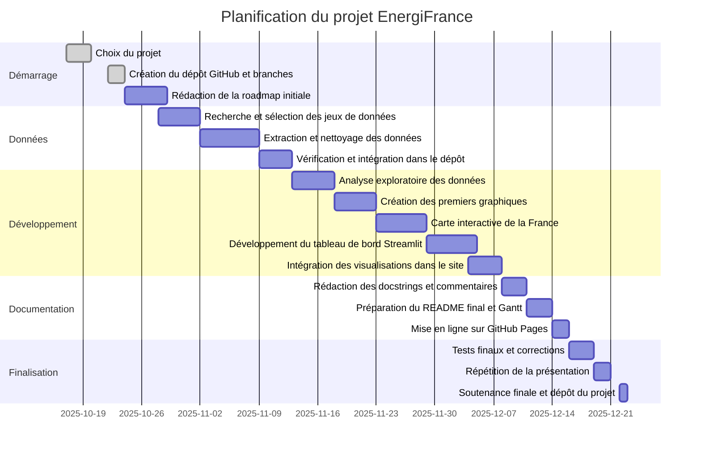

```mermaid
gantt
    dateFormat  YYYY-MM-DD
    title Planification du projet EnergiFrance
    todayMarker off

    %% PHASE 1
    section Démarrage
    Choix du projet                                      :done, a1, 2025-10-17, 3d
    Création du dépôt GitHub et branches                 :done, a2, 2025-10-22, 2d
    Rédaction de la roadmap initiale                     :a4, 2025-10-24, 5d

    %% PHASE 2
    section Données
    Recherche et sélection des jeux de données           :a5, 2025-10-28, 5d
    Extraction et nettoyage des données                  :a6, 2025-11-02, 7d
    Vérification et intégration dans le dépôt            :a7, 2025-11-09, 4d

    %% PHASE 3
    section Développement
    Analyse exploratoire des données                     :a8, 2025-11-13, 5d
    Création des premiers graphiques                     :a9, 2025-11-18, 5d
    Carte interactive de la France                       :a10, 2025-11-23, 6d
    Développement du tableau de bord Streamlit           :a11, 2025-11-29, 6d
    Intégration des visualisations dans le site          :a12, 2025-12-04, 4d

    %% PHASE 4
    section Documentation
    Rédaction des docstrings et commentaires             :a13, 2025-12-08, 3d
    Préparation du README final et Gantt                 :a14, 2025-12-11, 3d
    Mise en ligne sur GitHub Pages                       :a15, 2025-12-14, 2d

    %% PHASE 5
    section Finalisation
    Tests finaux et corrections                          :a16, 2025-12-16, 3d
    Répétition de la présentation                        :a17, 2025-12-19, 2d
    Soutenance finale et dépôt du projet                 :a18, 2025-12-22, 1d
```
